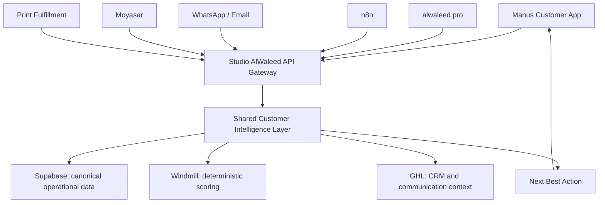

# Studio AlWaleed — Shared Customer Intelligence Layer Phase 2

## قرار معماري

يستهلك Manus إشارات العميل وينتج إشارات تفاعل، لكنه لا ينشئ قاعدة ذكاء مستقلة ولا يصبح مصدر الحقيقة. في هذه النسخة، كل شيء **Mock-only** داخل التطبيق لأغراض العرض والاختبار، مع عقود قابلة للنقل إلى طبقة ذكاء مشتركة خلف بوابة API.



## Unified identity

الهوية المرجعية هي `customer_id`. تتم المطابقة مستقبلًا باستخدام phone أو email موثق أو authenticated account أو CRM contact ID أو mapping قائم. لا يُنشأ ملف جديد لمجرد تبدل القناة. يظل التطبيق الضيف هو المسار الافتراضي ولا يفرض إنشاء حساب قبل الشراء.

## Customer 360 schema

ينظم الملف المجالات التالية: الهوية واللغة وقنوات التواصل الموثقة؛ العلاقة ومرحلة دورة الحياة ونوع العميل B2B/B2C؛ المعاملات والحجوزات والطلبات والمدفوعات؛ السلوك والخدمات والمنتجات والرفع وبدء الدفع والتخلي؛ التفضيلات؛ الاهتمامات؛ الحالة التشغيلية؛ وحقول الذكاء مثل intent وengagement وchurn risk وrecommended action.

كل قيمة ذكاء في النموذج تحمل `value`, `type`, `confidence`, `source`, و`updated_at`. الأنواع المسموحة هي **OBSERVED** و**CALCULATED** و**INFERRED** و**PREDICTED**.

## Event contract

```json
{
  "event_id": "evt_mock_123",
  "customer_id": "cus_mock_new_001",
  "event_type": "SERVICE_VIEWED",
  "timestamp": "2026-09-09T16:00:00.000Z",
  "channel": "manus_app",
  "session_id": "ses_mock_current",
  "object_type": "service",
  "object_id": "print",
  "metadata": { "entry_point": "hub" },
  "source_system": "manus_app"
}
```

الأحداث الأساسية: `APP_OPENED`, `SERVICE_VIEWED`, `PRODUCT_VIEWED`, `PHOTO_UPLOADED`, `BOOKING_STARTED`, `BOOKING_COMPLETED`, `CHECKOUT_STARTED`, `PAYMENT_COMPLETED`, `PAYMENT_FAILED`, `ORDER_CREATED`, `ORDER_REPEATED`, `QUOTE_REQUESTED`, `ORDER_STATUS_VIEWED`, و`SUPPORT_REQUESTED`.

## Next Best Action contract

العقد المقترح هو `GET /customer/{id}/next-best-action` ويعيد code وtitle وbody وreason وconfidence وsource وdismissible. الأكواد: `CONTINUE_BOOKING`, `COMPLETE_PAYMENT`, `TRACK_ACTIVE_ORDER`, `REORDER_PREVIOUS_PRODUCT`, `UPLOAD_BETTER_IMAGE`, `RECOMMEND_PRINT_SIZE`, `SHOW_CORPORATE_INTAKE`, `REQUEST_QUOTATION`, `SHOW_RELEVANT_CONTENT`, و`NO_ACTION`.

## Mock API في المشروع

أضيفت إجراءات tRPC عامة مؤقتة:

| الإجراء | الغرض |
|---|---|
| `customerIntelligence.profile` | جلب Customer 360 تجريبي حسب السيناريو |
| `customerIntelligence.nextBestAction` | جلب الاقتراح التالي المضبوط |
| `customerIntelligence.recordEvent` | تسجيل حدث تفاعل تجريبي |

هذه الإجراءات لا تكتب إلى Supabase ولا ترسل إلى أي قناة خارجية.

## خمسة سيناريوهات عرض

| إشارات العميل | الذكاء | Next Best Action | استجابة Manus | استجابة الأتمتة المستقبلية |
|---|---|---|---|---|
| جلسة أولى، لا طلبات | مرحلة جديدة، intent منخفض | `SHOW_RELEVANT_CONTENT` | اكتشاف الخدمات | لا إجراء؛ تسجيل APP_OPENED |
| طلبات طباعة سابقة وA5 | تفضيل مستنتج بثقة 0.84–0.91 | `REORDER_PREVIOUS_PRODUCT` | إعادة آخر طلب | اقتراح المنتج عبر القنوات المسموحة |
| طلب نشط | حقيقة تشغيلية OBSERVED | `TRACK_ACTIVE_ORDER` | عرض حالة الطلب | جلب حالة fulfillment |
| دفع بدأ ولم يكتمل | payment_pending وcheckout_abandoned OBSERVED | `COMPLETE_PAYMENT` | إكمال الطلب دون ضغط زائف | تذكير مسموح بعد سياسة الموافقة |
| طلب شركة ومجال Wall Art | نوع B2B OBSERVED، منتج مستنتج | `SHOW_CORPORATE_INTAKE` | فتح نموذج الشركة | إنشاء مراجعة في GHL عبر n8n |

## التخصيص والخصوصية

تظهر بطاقة واحدة بعنوان «اقتراحك التالي» ويمكن إخفاؤها. لا تستخدم الواجهة ندرة زائفة أو تسعيرًا مخفيًا أو ضغطًا زمنيًا. لا تُستنتج خصائص حساسة، ولا تُستخدم الصور خارج الغرض التشغيلي. يجب تحديد مدة احتفاظ للصور، مسار حذف، تقليل PII، وتسجيل تدقيق قبل الإنتاج.

## ملكية الأنظمة والتكامل

Supabase يحتفظ بالبيانات التشغيلية المرجعية، Moyasar هو مصدر حقيقة الدفع، GHL سياق CRM والتواصل، n8n تنسيق سير العمل، Windmill الحسابات الحتمية، وManus تجربة المستخدم. Phase 2 يتوقف هنا بانتظار موافقة المالك قبل أي تكامل أو تغيير إنتاجي.
