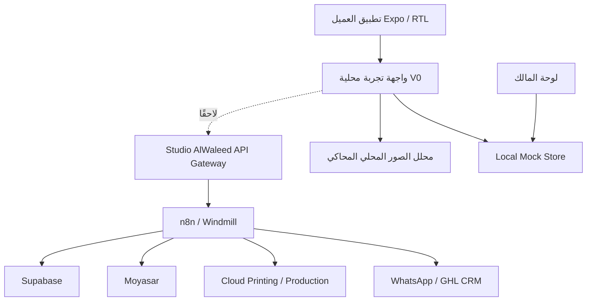

# Studio AlWaleed — Smart Photo Assistant V0

## نطاق النموذج

هذا النموذج عبارة عن طبقة تجربة عميل عربية RTL تعمل ببيانات وهمية ومحلية فقط. لم يتم ربط Supabase أو n8n أو Windmill أو GoHighLevel أو Moyasar أو Cloudprinter، كما لا توجد عمليات دفع أو سجلات عملاء حقيقية.

## الصفحات ومسارات التجربة

| الشاشة | الغرض |
|---|---|
| المساعد | سؤال البداية وعشرة نوايا واضحة بصريًا |
| لا أعرف — ساعدني | رحلة مبسطة من ثلاثة أسئلة بحد أقصى |
| رفع الصورة | اختيار صورة من الجهاز أو المتابعة بدون صورة لرؤية المحاكاة |
| التحليل | مؤشرات محاكاة للدقة والأبعاد والقص والخلفية والوجه والطباعة |
| التوصية | الاستخدام الأنسب والجودة والمقاس وأفضل خيار |
| خيارات الطباعة | Photo Print وCanvas وFrame مع مقاسات وأسعار تجريبية واضحة |
| فحص جواز/فيزا | أنواع مستندات ونتائج PASS / NEEDS ADJUSTMENT / UNSUITABLE |
| لوحة المالك | جلسات اليوم، الرفع، المنتجات، الرحلات المتروكة، المقاسات والنيات والأحداث |

## مخطط المعمارية المستقبلية

## نموذج البيانات الخفيف

| الكيان | الحقول المقترحة في V1 |
|---|---|
| Customer | `id`, `locale`, `createdAt`, `source` |
| Photo | `id`, `customerId`, `uri`, `width`, `height`, `orientation` |
| PhotoAnalysis | `photoId`, `resolution`, `aspectRatio`, `printQuality`, `cropCompatibility`, `backgroundSuitability`, `facePosition`, `enlargementPotential` |
| Product | `id`, `type`, `name`, `active` |
| PrintOption | `id`, `productId`, `label`, `dimensions`, `mockPrice` |
| Recommendation | `photoId`, `intent`, `quality`, `suggestedSize`, `bestAction`, `confidence` |
| Cart | `id`, `customerId`, `items`, `subtotal` |
| Order | `id`, `cartId`, `status`, `paymentStatus`, `productionStatus` |

## خريطة الأحداث الجاهزة

`app_started`, `photo_uploaded`, `intent_selected`, `analysis_completed`, `recommendation_viewed`, `product_selected`, `price_viewed`, `checkout_started`, `journey_abandoned`.

في V0 هذه الأحداث تمثيلية داخل الواجهة فقط. في V1 يمكن إرسالها إلى بوابة API موحدة بدل ربط التطبيق مباشرة بأي نظام إنتاجي.

## ما هو حقيقي وما هو وهمي؟

**حقيقي:** واجهة Expo، RTL، التنقل، اختيار صورة من مكتبة الجهاز عبر `expo-image-picker`، التوصيات الشرطية، اختيار المقاس، تبويب لوحة المالك، والاستجابة المبدئية للهاتف والويب.

**وهمي:** نتائج تحليل الذكاء الاصطناعي، الأسعار، مؤشرات لوحة المالك، نتائج فحص الجواز، التخزين، التحليلات، المعاينة الإنتاجية، الطلبات، الدفع، وشحن الصور لأي خدمة خارجية.

## ما يمكن أتمتته في المرحلة الثانية

يمكن إضافة بوابة API واحدة، تخزين صور مؤقت آمن، تحليل متعدد الوسائط عبر نموذج داخلي، كتالوج ومخزون وأسعار حقيقية، سلة وطلب ودفع، تهيئة ملفات الطباعة، إشعارات WhatsApp، مزامنة CRM، ولوحة تحليلات تعتمد على أحداث موثقة.

## ما لا ينبغي للتطبيق فعله بأمان

لا ينبغي أن يدّعي اعتمادًا حكوميًا لصور الجواز أو الفيزا، أو يضمن قبول صورة رسمية، أو يحتفظ بصور العملاء دون سياسة موافقة واحتفاظ واضحة، أو ينفذ الدفع من الواجهة مباشرة، أو يتصل بأنظمة الإنتاج قبل وجود مصادقة وصلاحيات وسجل تدقيق، أو يرسل صورة عميل إلى مزود خارجي دون موافقة صريحة.

## تقدير تحويل V0 إلى إنتاج

التحويل إلى نسخة إنتاجية أولى يتطلب تقريبًا **3–6 أسابيع** لفريق صغير، بحسب جاهزية بوابة API، كتالوج المنتجات، سياسة الخصوصية، موفر الدفع والطباعة، واختبارات قبول الصور الرسمية. هذا تقدير تخطيطي وليس التزامًا زمنيًا.
