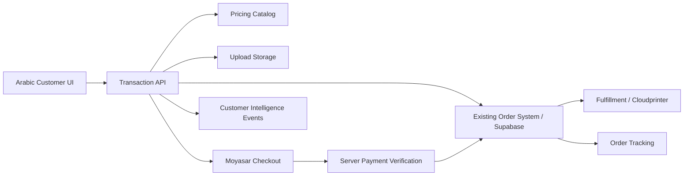

# Studio AlWaleed — 48-Hour Transaction Gate

**الحالة:** Mock + architecture + integration contracts only. لا نشر ولا تعديل إنتاجي.

## A. لوحة التنفيذ خلال 48 ساعة

| المرحلة | الناتج | الحالة | التصنيف |
|---|---|---|---|
| 0–4 ساعات | تثبيت مصدر الحقيقة والعقود | جاهز للتنفيذ | READY |
| 4–10 ساعات | مسار Photo Print مرجعي من المنتج إلى ملخص السعر | موجود Mock | READY |
| 10–16 ساعة | عقد الرفع والتحقق الأساسي للملف | واجهة اختيار موجودة، API ناقص | NEEDS CONNECTION |
| 16–22 ساعة | إنشاء order عبر بوابة المعاملة | Mock فقط | NEEDS CONNECTION |
| 22–28 ساعة | حالات الدفع الأربع والتحقق الخادمي | Mock contract موجود | NEEDS CONNECTION |
| 28–36 ساعة | رقم الطلب والتتبع الآمن | UX Mock موجود جزئيًا | NEEDS DEVELOPMENT |
| 36–42 ساعة | اختبار E2E بالنجاح والفشل والإلغاء والانتهاء | Mock harness موجود | READY |
| 42–48 ساعة | قبول المالك ومراجعة الأمان | يتطلب اعتمادًا | BLOCKED |

**48-Hour Critical Path:** `Photo product → upload → pricing quote → cart → order draft → checkout → payment verification → order number → status/tracking`.

**7-Day Enhancements:** دعوات CSV الشخصية، لوحة RSVP، حركات الدعوات، Customer 360 متقدم، توصيات متقدمة، توجيه الطباعة متعدد المزودين، مزودو POD ثانويون، والتحسينات التجميلية.

## B. تدقيق الوضع الحالي

| المكوّن | ما هو موجود | التصنيف |
|---|---|---|
| Customer UI RTL | مساعد الصور، Hub، السلة، الدعوات | READY |
| Product selection | Photo Prints وCanvas وFrame و3 قوالب دعوات | READY للـMock |
| Cart | `lib/cart-store.ts` مع كمية ومجموع فرعي | READY للـMock |
| Customer identity | Customer Intelligence mock وcustomer_id | NEEDS CONNECTION |
| File upload | expo-image-picker واختيار صورة محلي | NEEDS CONNECTION للتحقق والتخزين |
| Pricing | أسعار Mock داخل المنتجات | NEEDS CONNECTION إلى catalog/pricing |
| Order | رسالة MOCK-2048 فقط | NEEDS DEVELOPMENT/CONNECTION |
| Payment | لا يوجد دفع حقيقي؛ شاشة تأكيد Mock | NEEDS CONNECTION إلى Moyasar |
| Verification | عقد Mock في `transaction-core.ts` | NEEDS CONNECTION إلى تحقق خادمي |
| Order status | حالات نصية أولية | NEEDS DEVELOPMENT ثم CONNECTION |
| Tracking | لا يوجد مصدر حالة إنتاجي | NEEDS CONNECTION |
| Supabase orders | مذكور كمالك مستقبلي، لم يُلمس | READY كمصدر ملكية، NEEDS CONNECTION |
| n8n/Windmill/GHL/Cloudprinter | غير متصلة | NOT REQUIRED FOR 48H mock؛ NEEDS CONNECTION لاحقًا |
| Production credentials | غير مطلوبة الآن | NOT REQUIRED FOR 48H |
| Publishing | مجمّد بناءً على طلب المالك | BLOCKED intentionally |

## C. النواة العامة للمعاملة

المحرك واحد وقابل لإعادة الاستخدام عبر Photo Printing وPrint Products وStudio Booking وDigital Invitations وFuture Services. يمر كل مسار عبر `product_type` بدل إنشاء order system مستقل. طباعة الصور هي أول مرجع E2E فقط.

## D. عقود API والبيانات

### Customer

`POST /customers/resolve` يستقبل `{phone?, email?, authenticated_account_id?, crm_contact_id?}` ويعيد `{customer_id, identity_source, locale, verified_channels}`. لا ينشئ ملفًا مكررًا عند تغيير القناة.

### Product

`GET /products?product_type=photo_print` يعيد `product_id, product_type, name, size, material, finish, availability, currency` مع عدم اعتماد السعر النهائي من العميل.

### Cart

`POST /carts` ينشئ سلة مرتبطة بـ`customer_id`. `PATCH /carts/{cart_id}` يرسل `items[]` وكل عنصر يملك `product_id, quantity, file_ids`. يعيد الخادم `subtotal, shipping, tax, total, pricing_version`.

### File Upload

`POST /uploads/initiate` يعيد upload target و`file_id`. يتم الرفع الصريح من العميل فقط. `POST /uploads/{file_id}/complete` يطلب فحص MIME والحجم والأبعاد والغرض وسياسة الاحتفاظ. لا تحفظ الواجهة الصورة كمصدر حقيقة.

### Pricing

`POST /pricing/quote` يستقبل cart وdelivery context ويعيد `subtotal, shipping, tax, total, currency, pricing_version, valid_until, source`. السعر ينتهي ويعاد حسابه على الخادم عند إنشاء الطلب.

### Order

`POST /orders` يحول cart إلى Order بعد إعادة تسعير الخادم. يعيد `order_id, order_number, status, payment_status, amount, currency`. الملكية: existing Supabase orders، وليس Manus.

### Checkout / Payment

`POST /checkout` ينشئ payment intent عبر بوابة الخادم ويرجع client-safe checkout data فقط. Moyasar هو مصدر حقيقة الدفع. لا ترسل مفاتيح سرية أو بيانات بطاقة إلى التطبيق.

### Payment Verification

`POST /payments/{payment_id}/verify` يتحقق خادميًا من provider status، amount، currency، order binding، والتوقيع/المرجع. يعيد `verified, payment_status, order_status`. لا تعتبر الواجهة redirect نجاحًا نهائيًا.

### Status / Tracking

`GET /orders/{order_id}/status` للاستخدام بعد المصادقة. `GET /order-status/{order_number}` يعيد الحد الأدنى الآمن: order status، payment status، production stage، estimated readiness، delivery status. لا يعيد حقول قاعدة البيانات الداخلية.

## E. تجربة العميل العربية

1. يختار العميل Photo Print أو أي خدمة مستقبلية.
2. يرفع الملف المطلوب أو يضيف المعلومات.
3. يرى التحقق الأولي للملف، المنتج، المقاس، الكمية، والسعر التجريبي.
4. يراجع ملخص الطلب.
5. ينشئ Order draft ويحصل على رقم مرجعي بعد قبول الخادم.
6. يبدأ الدفع عبر Moyasar لاحقًا.
7. يعود إلى التطبيق؛ لا يُعرض «مدفوع» حتى تحقق الخادم.
8. يرى رقم الطلب وحالته في Timeline.

## F. حالات الخطأ والدفع

| الحالة | رسالة عربية | إجراء العميل |
|---|---|---|
| File rejected | الملف غير مناسب لهذا المنتج | اختيار ملف آخر |
| Price expired | تغيّر السعر أو انتهت صلاحية العرض | إعادة حساب السعر |
| Out of stock | المنتج غير متاح حاليًا | اختيار منتج بديل |
| Payment failed | لم تكتمل العملية | إعادة المحاولة أو تغيير الطريقة |
| Payment cancelled | ألغيت العملية ولم يتم الخصم | العودة للدفع أو تعديل الطلب |
| Payment expired | انتهت جلسة الدفع | بدء جلسة جديدة |
| Verification pending | نتحقق من العملية، لا تعِد الدفع الآن | الانتظار/التحديث |
| Verification failed | تعذر التحقق؛ لم نثبت نجاح الدفع | التواصل مع الدعم، لا تُنشأ حالة Paid |
| Order creation failed | لم يُنشأ الطلب | إعادة المحاولة مع نفس cart idempotency key |
| Tracking unavailable | لا تتوفر حالة محدثة الآن | المحاولة لاحقًا |

## G. Payment state machine

`PENDING → PROCESSING → VERIFIED`، أو `PENDING → CANCELLED`، أو `PROCESSING → FAILED`، أو `PROCESSING → EXPIRED`. لا ينتقل Order إلى `PAID` إلا من `VERIFIED` صادر عن تحقق الخادم.

## H. Order state machine

`DRAFT → PENDING_UPLOAD → READY_FOR_PRICING → PENDING_PAYMENT → PAYMENT_PROCESSING → PAID → PROCESSING → READY → DELIVERED`. المسارات الطرفية: `CANCELLED` و`FAILED`. لا يستخدم العميل أو Manus قاعدة بيانات موازية.

## I. الجاهزية للربط

- [x] product_type عام
- [x] عقد Cart وPricing وOrder وPayment وTracking
- [x] حالات Mock success/failed/cancelled/expired
- [x] مصدر حقيقة محدد لكل نظام
- [x] عدم طلب credentials الآن
- [ ] endpoint API Gateway فعلي
- [ ] catalog/product IDs الحقيقية
- [ ] Supabase order schema وidempotency policy
- [ ] upload storage policy وretention
- [ ] Moyasar server credentials وwebhook/verification policy
- [ ] payment return URLs
- [ ] fulfillment status mapping
- [ ] owner approval للبيانات والخصوصية

## J. التسلسل الدقيق للربط الإنتاجي

1. اعتماد العقود ومصدر الحقيقة من المالك.
2. تجهيز API Gateway وauth وidempotency وaudit logging.
3. ربط `GET /products` و`POST /pricing/quote` بالكتالوج الحقيقي.
4. ربط upload initiation/storage/validation مع سياسة الاحتفاظ.
5. ربط `POST /orders` بنظام Supabase orders الموجود دون schema موازٍ.
6. إضافة Moyasar checkout server-side وreturn handling.
7. تفعيل payment verification قبل تغيير order state.
8. ربط Cloudprinter/fulfillment بعد ثبات Paid.
9. تفعيل tracking read model الآمن.
10. ربط أحداث المعاملة بطبقة Customer Intelligence المشتركة.
11. اختبار sandbox ثم قبول المالك ثم rollout محدود؛ لا نشر قبل الموافقة.

## الخلاصة التنفيذية

**جاهز:** النواة العامة والـMock contracts، السلة، ملخص السعر التجريبي، حالات الدفع، ومسار Photo Print المرجعي على مستوى المحاكاة.

**يحتاج اتصالًا:** الكتالوج، التسعير، التخزين، orders في Supabase، Moyasar، التحقق، fulfillment، والتتبع.

**واقعي خلال 48 ساعة:** إكمال Mock E2E موحد، تثبيت العقود، اختبار الحالات الأربع، واعتماد UX وحواجز الأمان.

**البلوكات:** صلاحية الوصول إلى API Gateway، schema orders الحالي، product catalog، سياسة الملفات، وموافقة المالك على payment verification والتتبع. لا نطلب credentials في هذه المرحلة.

**أول تكامل إنتاجي بعد الاعتماد:** `GET /products` ثم `POST /pricing/quote` عبر API Gateway؛ لأن بقية المعاملة لا يمكن تثبيتها بأمان قبل أن يكون المنتج والسعر مصدرهما صحيحين.
